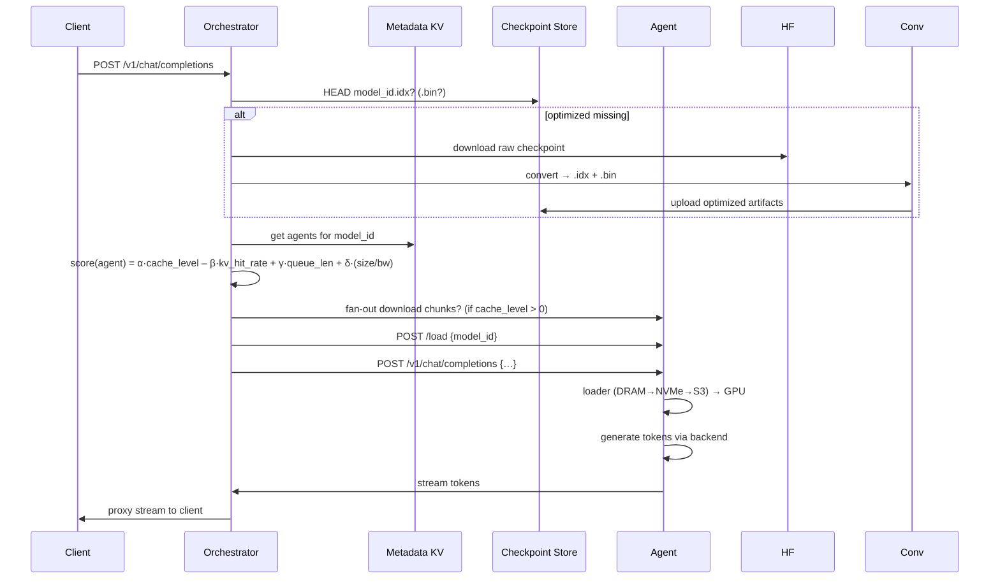

**architecture.md\***architecture.md\*\*

# ServerlessLLM MVP Architecture

A low‐latency, OpenAI-compatible, multi-backend serverless LLM inference system—built for extreme performance.

---

## 1. System Overview

```mermaid
flowchart LR
  Client[Client<br/>(OpenAI API)]
  Orch[Orchestrator<br/>(Rust)]
  KV[Metadata KV<br/>(etcd/Redis)]
  CS[Checkpoint Store<br/>(S3/Blob/HF)]
  Agent[Agent Daemon<br/>(Rust + Zig)]

  Client -->|REST/gRPC| Orch
  Orch --> KV
  Orch --> CS
  Orch --> Agent
  Agent --> KV
  Agent --> CS
  Agent --> Orch
```

---

## 2. Components & Tech Stack

| Component                   | Responsibility                                                          | Language / Tech          |
| --------------------------- | ----------------------------------------------------------------------- | ------------------------ |
| **Checkpoint Converter**    | raw HF/PyTorch → optimized `.idx` + `.bin`                              | Python + Rust            |
| **Model Ingestion Service** | on–demand fetch HF checkpoint → convert → upload to store               | Python                   |
| **Metadata KV Store**       | `model_id → [ {agent,cache,kv_hit,queue} ]`                             | etcd (Go) or Redis       |
| **Orchestrator / API GW**   | OpenAI spec endpoints, scheduler, fan-out downloader, ingestion trigger | Rust (Tokio, warp)       |
| **Agent Daemon**            | heartbeat, download queue, multi-tier loader, inference μService        | Rust (control-plane)     |
| **Multi-Tier Loader**       | DRAM/NVMe/S3 → pinned buf → CUDA DMA                                    | Zig (data-plane)         |
| **Inference μService**      | OpenAI spec serve → backend adapter plugins (vLLM/Triton/others)        | Rust + FFI (C++/Py)      |
| **Checkpoint Store**        | stores optimized `.idx` + `.bin`                                        | S3 / Azure Blob / HF     |
| **Monitoring**              | metrics export (load times, kv hits, queue lengths)                     | Prometheus / Grafana     |
| **CI/CD Pipeline**          | trains/fine-tunes → checkpoint conversion → upload optimized artifacts  | GitHub Actions / Jenkins |

---

## 3. Request Flow



---

## 4. Scalability & Extensibility

- **Multi-Backend Support**: pluggable adapters for vLLM, Triton, llama.cpp, etc.
- **Stateless Orchestrator**: horizontal scale behind load-balancer.
- **Distributed Metadata**: resilient etcd/Redis cluster.
- **Agent Auto-Discovery**: via heartbeats.
- **Future Extensions**: live migration, layered streaming, RDMA P2P, quantization (see roadmap.md).oadmap features can be added modularly.
